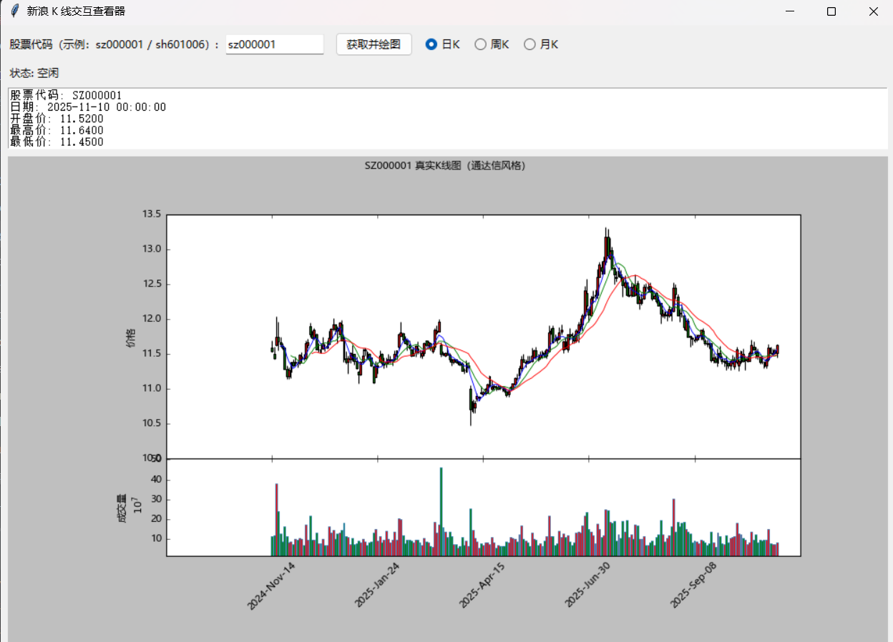

# Interactive K-Line Viewer（通达信风格股票K线可视化工具）

一款基于 **Python + Tkinter + mplfinance** 的桌面端股票 K 线交互分析工具。  
支持 **日K / 周K / 月K** 多周期切换，行情数据实时来自新浪财经公开接口，并采用 **通达信风格配色（红涨绿跌）** 进行蜡烛图展示。

该工具小巧易用，不依赖券商终端，可作为 **K线学习辅助 / 行情观察 / 股票可视化教育分析工具**。

---

## 🖼 软件界面展示

下面为程序实际界面效果图：

(./effect/2.png)(./effect/3.png)

> 如果你希望界面图更加清晰，我可以帮你生成更专业的展示封面与界面排版。

---

## ✨ 功能特性

| 功能 | 描述 |
|---|---|
| 输入股票代码实时获取行情 | 支持 `shXXXXXX`、`szXXXXXX` |
| 支持多级别 K 线切换 | 日K / 周K / 月K |
| 通达信配色蜡烛图 | 红涨绿跌、成交量分层直观展示 |
| 行情数据实时解析 | 展示涨跌幅、开收盘、成交量、涨速等指标 |
| 中文字体自动适配 | 跨 Windows / macOS / Linux 平台无乱码 |
| 图形界面操作简单 | 无需命令行基础，新手友好 |

---

## 🛠 技术栈

- Python 3.8+
- Tkinter（图形界面）
- mplfinance（K线绘图）
- matplotlib（绘图支持）
- pandas（行情数据结构化处理）
- requests（行情数据请求）

---

## 📦 安装依赖

```bash
pip install matplotlib mplfinance pandas requests
